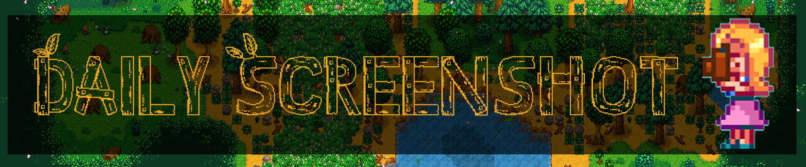

# Daily Screenshot v2.0

> A Stardew Valley mod that automatically takes a screenshot of based on rules

Releases can be found at the following websites:

- [NexusMods](https://www.nexusmods.com/stardewvalley/mods/4779)
- [Chucklefish](https://community.playstarbound.com/resources/daily-screenshot.5907/)
- [CurseForge](https://www.curseforge.com/stardewvalley/mods/daily-screenshot)
- [ModDrop](https://www.moddrop.com/stardew-valley/mods/677025-daily-screenshot)

## Features

- A screenshot is automatically taken of your entire farm every day as soon as you leave your house.
- Choose what time the screenshot gets taken.
- Choose how often a screenshot gets taken.
- Stores screenshots in the StardewValley/Screenshots folder, with each save file getting its own "FarmName-Screenshots" folder, so you can easily access the screenshots in-game under the "Options" tab in the menu and screenshots from multiple save files will not get mixed up. The file path to the screenshots folder is C:\Users\USERNAME\AppData\Roaming\StardewValley\Screenshots
- Makes it super easy to gather screenshots to create a GIF that shows how your farm changes over time! There are many GIF makers that can be found online, such as [ezgif GIF maker](https://ezgif.com/maker).  Here is an [example](example.gif).
- Keeps the screenshots in the correct order to make creating the GIF easier. This is achieved by naming each screenshot with a "year-season-day.png" numerical format. For example, on Year 1, Spring, Day 3, the screenshot would be named "01-01-03.png".
- Can enable a keyboard shortcut for taking screenshots (set to "None" by default, so you need to specify a key on your keyboard in the Config file for this to work)
- Custom configuration options! See below.

## Installation

1. [Install the latest version of SMAPI](https://smapi.io/).
1. Download this mod and unzip it into Stardew Valley/Mods.
1. Run the game using SMAPI.

## Compatibility

- Works with Stardew Valley 1.4 or later on Linux/Mac/Windows.
- Works in both single player and multiplayer.
- No known mod conflicts.

## Configuration File

> Note: Older configuration files will automatically be upgraded to the newer format

You can add as many rules as you would like.  The config file looks like:

```json
{
  "SnapshotRules": [
    {
      "Name": "Daily Farm Picture",
      "ZoomLevel": 0.25,
      "Directory": "Default",
      "FileName": "Default",
      "Trigger": {
        "Days": "Daily",
        "Weather": "Any",
        "Location": "Farm",
        "Key": "None",
        "StartTime": 600,
        "EndTime": 2600
      }
    },
    {
      "Name": "Keypress Picture",
      "ZoomLevel": 1.0,
      "Directory": "/home/bob/SDV",
      "FileName": "None",
      "Trigger": {
        "Days": "Daily",
        "Weather": "Any",
        "Location": "Any",
        "Key": "Multiply",
        "StartTime": 600,
        "EndTime": 2600
      }
    }
  ]
}
```

Triggers are things that must happen for a screenshot to take place.  All of the items must be true.  Automatic screen shots (without a key press) happen at most once a day.

| Setting | Description | Type | Default Setting |
| --------|------- | -------- | -------- |
| Name | What to show when taking a picture.  Rules without a name will be given a name automatically | string | Unnamed Rule # |
| ZoomLevel | How should the picture be scaled.  Any number between 0.25 and 1.0 | float | 0.25 |
| Directory | Where to save the picture.<BR/><BR/>Default or empty means the standard Startdew Valley screenshot directory.<BR/><BR/>**Note: Remember to use a double backslash on Windows.** | string | Default |
| Filename | A combination of values for the filename, seperated by commas.<BR/><BR/>Possible values are: None, Date, Farmname, GameID, Location, Weather, Playername, Time, UniqueID.<BR/><BR/>Will follow the pattern: {Farm Name}-{GameID}/{Location}/{Weather}/{Player Name}-{Date}-{Time}-{Unique ID} | Enum | Date, FarmName, GameID, Location |
| Days | A combination of values for the days and seasons to take a screen shot.<br/><br/>Possible values are: Day_01 .. Day_28, Sundays, Mondays, Tuesdays, Wednesdays, Thursdays, Fridays, Saturdays, FirstDayOfTheMonth, LastDayOfTheMonth, Spring, Summer, Fall, Winter, AnySeason, AnyDay, Daily.<BR/><BR/>**Note: It is important if not using the daily value to specify season(s) and day(s) or a picture will not be taken.**<BR/><BR/>Example: To take a picture on the 15th of fall use Day_15, Fall. | enum | Daily |
| Weather| A combination of values for the weather.<BR/><BR/>Possible values are: Sunny, Rainy, Windy, Stormy, Snowy, Any. | enum | Any |
| Location | A combination of locations to take a picture.  Picture will be taken when going to one of these locations.<BR/><BR/>Possible values are: Farm, Farmhouse, Greenhouse, Beach, FarmCave, Cellar, Desert, Museum, CommunityCenter, Moutain, Unknown, Any. <BR/><BR/>**Note: Unknown is not any of the listed locations.** | enum | Any |
| Key | Key press to look for to take a picture.  If set the picture will be taken on demand and not automatically.<BR/><BR/>Possible values: [List of possible keybindings](https://stardewvalleywiki.com/Modding:Player_Guide/Key_Bindings) | enum | None |
| StartTime | Earliest point at which to take the picture.  The time cannot be more than EndTime and must be less than 600.  Must be an increment of 10. | int | 600 |
| EndTime | Lasest point at which to take the picture. The time cannot be less than StartTime and cannot be more than 2600. Must be an increment of 10. | int | 2600 |

## License

[](https://creativecommons.org/publicdomain/zero/1.0/)
This work is licensed under a [Creative Commons Attribution 1.0 International License](http://creativecommons.org/licenses/by/1.0/).
